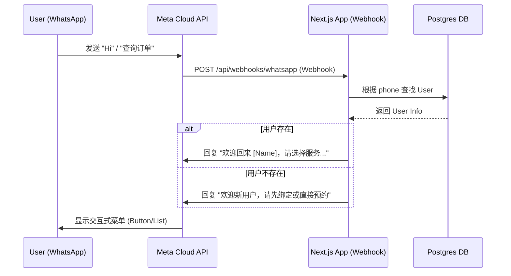

# 📱 WhatsApp Integration Plan for String Service Platform

**Version:** 1.0  
**Date:** 2025-12-29  
**Status:** Draft / Proposal  

---

## 1. 目标 (Objective)

将 WhatsApp 集成到 String Service Platform，使用户能够通过 WhatsApp 完成核心业务交互，实现 "Chat as Interface"。

**主要功能：**
1.  **自动识别身份**：通过 WhatsApp 手机号自动匹配系统用户。
2.  **快捷查询**：查询订单状态、会员积分、优惠券。
3.  **无缝预约**：通过 WhatsApp 发起预约（Chatbot 引导 或 Webview）。
4.  **实时通知**：订单状态变更（已完成/已接单）直接推送到 WhatsApp。

---

## 2. 架构设计 (Architecture)

我们将直接使用 **Meta WhatsApp Cloud API** (官方 API)，无需第三方中间件（如 Twilio），以降低成本并获得最新功能支持。

### 2.1 系统交互图



### 2.2 核心组件

1.  **Webhook Endpoint (`src/app/api/webhooks/whatsapp/route.ts`)**
    -   负责接收 Meta 的 POST 请求。
    -   验证签名（Security）。
    -   解析消息类型（Text, Interactive, Status Update）。

2.  **WhatsApp Service (`src/services/whatsapp.ts`)**
    -   封装发送消息的逻辑（Send Text, Send Template, Send Interactive Menu）。
    -   处理业务逻辑路由（Router）。

3.  **用户绑定机制**
    -   数据库 `users` 表已有 `phone` 字段。
    -   逻辑：当收到 WhatsApp 消息时，直接 `SELECT * FROM users WHERE phone = incoming_phone`。
    -   **注意**：WhatsApp 号码通常带国家代码（如 `60123456789`），需做格式标准化处理。

---

## 3. 功能规划 (Feature Roadmap)

### Phase 1: 基础通知与查询 (MVP)
*目标：建立连接，替换 SMS 通知，提供基础查询。*

-   **入站消息处理**：识别 "Hi", "Menu"。
-   **身份识别**：基于手机号自动问候。
-   **主菜单**：
    -   🔍 **Check Status** (查询最近订单状态)
    -   💰 **My Points** (查询积分余额)
    -   📅 **Book Now** (返回 Web App 预约链接)
-   **出站通知**：
    -   当 Admin 更新订单状态为 `Completed` 时，自动发送 WhatsApp Template Message。

### Phase 2: 深度集成 (Conversational UI)
*目标：在 WhatsApp 内闭环简单操作。*

-   **快速预约 (Flows)**：
    -   使用 **WhatsApp Flows** (Native Form) 让用户在 WhatsApp 内选择球拍、拉力。
    -   或者使用 **List Messages** 选择球线品牌。
-   **发送图片**：
    -   用户直接在 WhatsApp 发送球拍照片（用于多球拍订单）。
    -   系统自动上传至 Object Storage / Local Storage 并关联订单。

---

## 4. 技术实现细节 (Technical Implementation)

### 4.1 数据库准备

无需大幅修改，但需确保手机号格式统一。建议新增工具函数：

```typescript
// src/lib/utils/phone.ts
export function normalizePhone(raw: string): string {
  // 移除 + 号，空格，确保以 60 开头 (针对马来西亚)
  // e.g., "+60 12-345 6789" -> "60123456789"
}
```

### 4.2 Webhook 结构示例

```typescript
// src/app/api/webhooks/whatsapp/route.ts
export async function POST(req: Request) {
  const body = await req.json();
  
  // 1. 验证 Meta Token (GET 请求用于握手)
  
  // 2. 处理消息 (POST 请求)
  const entry = body.entry?.[0];
  const changes = entry?.changes?.[0];
  const value = changes?.value;
  const message = value?.messages?.[0];

  if (message) {
    const senderPhone = message.from; // e.g., "60123456789"
    const text = message.text?.body;
    
    // 调用业务处理逻辑
    await handleIncomingMessage(senderPhone, text);
  }

  return NextResponse.json({ status: 'ok' });
}
```

### 4.3 菜单交互设计 (Interactive Messages)

不要让用户打字，尽量使用按钮：

**主菜单示例：**
> **String Service Bot:**
> 👋 Hi Tan! Welcome to String Service.
> What would you like to do?
>
> [ 📅 New Booking ]
> [ 🔍 Check Status ]
> [ 👤 My Profile ]

---

## 5. 部署前准备 (Prerequisites)

在开始编码前，需要完成以下注册步骤：

1.  **Meta Developer Account**: 创建应用。
2.  **WhatsApp Business Platform**: 在 Meta 后台启用。
3.  **Test Number**: Meta 提供一个测试号码用于开发。
4.  **Access Token & Verify Token**: 获取并在 `.env` 配置。

**环境变量配置 (`.env`):**
```env
WHATSAPP_API_TOKEN=EAAG...
WHATSAPP_PHONE_NUMBER_ID=100...
WHATSAPP_VERIFY_TOKEN=my_secure_verify_token
WHATSAPP_BUSINESS_ACCOUNT_ID=...
```

---

## 6. 下一步行动 (Action Items)

1.  **用户确认**：是否同意使用 Meta Cloud API（免费额度通常够用：每月前 1000 次会话免费）。
2.  **环境配置**：用户需要在 Meta Developers 注册并获取 Token。
3.  **代码实现**：
    -   创建 Webhook 路由。
    -   实现 `WhatsAppService`。
    -   集成到 `notifications` 模块。

---
