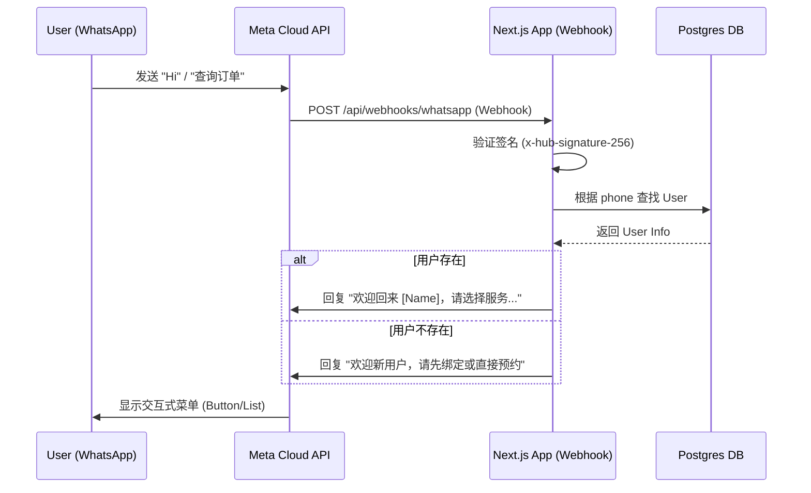

# 📱 WhatsApp Integration Plan for String Service Platform

**Version:** 2.0  
**Date:** 2025-12-31  
**Status:** Ready for Development  

---

## 1. 目标 (Objective)

将 WhatsApp 集成到 String Service Platform，使用户能够通过 WhatsApp 完成核心业务交互，实现 "Chat as Interface"。

**主要功能：**
1. **自动识别身份**：通过 WhatsApp 手机号自动匹配系统用户。
2. **快捷查询**：查询订单状态、会员积分、优惠券。
3. **无缝预约**：通过 WhatsApp 发起预约（Chatbot 引导 或 Webview）。
4. **实时通知**：订单状态变更（已完成/已接单）直接推送到 WhatsApp。

---

## 2. 架构设计 (Architecture)

使用 **Meta WhatsApp Cloud API** (官方 API)，无需第三方中间件（如 Twilio），以降低成本并获得最新功能支持。

### 2.1 系统交互图



### 2.2 文件结构

```text
src/
  app/
    api/
      webhooks/
        whatsapp/
          route.ts              # Webhook 入口（GET验证 + POST消息处理）
  services/
    whatsapp/
      whatsapp.service.ts       # 核心服务（发送消息API封装）
      whatsapp.handler.ts       # 消息路由器（处理不同消息类型）
      whatsapp.templates.ts     # 模板消息定义
      whatsapp.types.ts         # TypeScript 类型定义
  lib/
    utils/
      phone.ts                  # 手机号格式标准化
```

### 2.3 核心组件

| 组件 | 职责 |
|------|------|
| **Webhook Route** | 接收 Meta POST 请求，验证签名，解析消息 |
| **WhatsApp Service** | 封装发送消息 API（Text, Template, Interactive） |
| **Message Handler** | 业务逻辑路由（根据用户输入决定响应） |
| **Phone Utility** | 手机号格式标准化（处理 +60, 60, 0 等前缀） |

---

## 3. 功能规划 (Feature Roadmap)

### Phase 1: 基础通知与查询 (MVP) — 预计 2.5 天

| 功能 | 描述 | 优先级 |
|------|------|--------|
| Webhook 验证 | GET 请求握手 + POST 签名验证 | P0 |
| 入站消息处理 | 识别 "Hi", "Menu", 关键词 | P1 |
| 身份识别 | 基于手机号自动问候用户 | P1 |
| 主菜单 | 交互式按钮：查订单/查积分/预约 | P1 |
| 订单状态查询 | 返回用户最近订单状态 | P2 |
| 出站通知 | 订单完成时发送 Template Message | P2 |

**主菜单交互示例：**
```
👋 Hi Tan! Welcome to String Service.
What would you like to do?

[ 📅 New Booking ]
[ 🔍 Check Order Status ]
[ 💰 My Points ]
```

### Phase 2: 深度集成 (Conversational UI) — 预计 3 天

| 功能 | 描述 |
|------|------|
| WhatsApp Flows | 在 WhatsApp 内完成球线选择 |
| 图片接收 | 用户直接发送球拍照片，自动关联订单 |
| 付款通知 | 收到付款后发送确认 |
| 取件提醒 | 订单完成后定时提醒取件 |

---

## 4. 技术实现细节 (Technical Implementation)

### 4.1 环境变量配置

```env
# .env.local
WHATSAPP_API_TOKEN=EAARbq...                    # 从 Meta 后台生成
WHATSAPP_PHONE_NUMBER_ID=935155509677319        # 你的号码 ID
WHATSAPP_BUSINESS_ACCOUNT_ID=126471884845467384 # 商业账户 ID
WHATSAPP_VERIFY_TOKEN=my_string_webhook_token   # 自定义验证令牌
WHATSAPP_APP_SECRET=...                         # 用于签名验证
```

### 4.2 手机号标准化

```typescript
// src/lib/utils/phone.ts
export function normalizePhone(raw: string): string {
  // 移除所有非数字字符
  let cleaned = raw.replace(/\D/g, '');
  
  // 处理马来西亚号码格式
  if (cleaned.startsWith('0')) {
    cleaned = '60' + cleaned.slice(1); // 0123456789 -> 60123456789
  } else if (!cleaned.startsWith('60') && cleaned.length === 9) {
    cleaned = '60' + cleaned; // 123456789 -> 60123456789
  }
  
  return cleaned;
}

export function formatPhoneForDisplay(phone: string): string {
  // 60123456789 -> +60 12-345 6789
  if (phone.startsWith('60') && phone.length === 11) {
    return `+60 ${phone.slice(2, 4)}-${phone.slice(4, 7)} ${phone.slice(7)}`;
  }
  return phone;
}
```

### 4.3 Webhook 实现（含签名验证）

```typescript
// src/app/api/webhooks/whatsapp/route.ts
import { NextRequest, NextResponse } from 'next/server';
import crypto from 'crypto';
import { handleIncomingMessage } from '@/services/whatsapp/whatsapp.handler';

// GET: Webhook 验证握手
export async function GET(req: NextRequest) {
  const searchParams = req.nextUrl.searchParams;
  const mode = searchParams.get('hub.mode');
  const token = searchParams.get('hub.verify_token');
  const challenge = searchParams.get('hub.challenge');

  if (mode === 'subscribe' && token === process.env.WHATSAPP_VERIFY_TOKEN) {
    console.log('✅ Webhook verified');
    return new NextResponse(challenge, { status: 200 });
  }
  
  return NextResponse.json({ error: 'Forbidden' }, { status: 403 });
}

// POST: 接收消息
export async function POST(req: NextRequest) {
  const rawBody = await req.text();
  
  // 1. 验证签名
  if (!verifySignature(req, rawBody)) {
    console.error('❌ Invalid signature');
    return NextResponse.json({ error: 'Invalid signature' }, { status: 401 });
  }

  // 2. 解析消息
  const body = JSON.parse(rawBody);
  const entry = body.entry?.[0];
  const changes = entry?.changes?.[0];
  const value = changes?.value;
  const message = value?.messages?.[0];

  if (message) {
    const senderPhone = message.from;
    const messageType = message.type;
    
    // 异步处理，立即返回 200（Meta 要求 20 秒内响应）
    handleIncomingMessage(senderPhone, message).catch(console.error);
  }

  // 处理状态更新回调
  const statuses = value?.statuses?.[0];
  if (statuses) {
    console.log(`📬 Message ${statuses.id}: ${statuses.status}`);
  }

  return NextResponse.json({ status: 'ok' });
}

// 签名验证函数
function verifySignature(req: NextRequest, rawBody: string): boolean {
  const signature = req.headers.get('x-hub-signature-256');
  if (!signature || !process.env.WHATSAPP_APP_SECRET) return false;

  const hmac = crypto.createHmac('sha256', process.env.WHATSAPP_APP_SECRET);
  const expectedSignature = `sha256=${hmac.update(rawBody).digest('hex')}`;
  
  return crypto.timingSafeEqual(
    Buffer.from(signature),
    Buffer.from(expectedSignature)
  );
}
```

### 4.4 WhatsApp Service

```typescript
// src/services/whatsapp/whatsapp.service.ts
const WHATSAPP_API_URL = 'https://graph.facebook.com/v22.0';

interface SendMessageOptions {
  to: string;
  type: 'text' | 'template' | 'interactive';
  content: any;
}

export async function sendWhatsAppMessage(options: SendMessageOptions) {
  const { to, type, content } = options;
  const phoneNumberId = process.env.WHATSAPP_PHONE_NUMBER_ID;
  
  const payload: any = {
    messaging_product: 'whatsapp',
    recipient_type: 'individual',
    to,
  };

  if (type === 'text') {
    payload.type = 'text';
    payload.text = { body: content };
  } else if (type === 'template') {
    payload.type = 'template';
    payload.template = content;
  } else if (type === 'interactive') {
    payload.type = 'interactive';
    payload.interactive = content;
  }

  const response = await fetch(
    `${WHATSAPP_API_URL}/${phoneNumberId}/messages`,
    {
      method: 'POST',
      headers: {
        'Authorization': `Bearer ${process.env.WHATSAPP_API_TOKEN}`,
        'Content-Type': 'application/json',
      },
      body: JSON.stringify(payload),
    }
  );

  if (!response.ok) {
    const error = await response.json();
    console.error('❌ WhatsApp API Error:', error);
    throw new Error(`WhatsApp API Error: ${error.error?.message}`);
  }

  return response.json();
}

// 发送主菜单
export async function sendMainMenu(to: string, userName?: string) {
  const greeting = userName ? `Hi ${userName}! ` : 'Hi! ';
  
  return sendWhatsAppMessage({
    to,
    type: 'interactive',
    content: {
      type: 'button',
      body: {
        text: `👋 ${greeting}Welcome to String Service.\nWhat would you like to do?`
      },
      action: {
        buttons: [
          { type: 'reply', reply: { id: 'new_booking', title: '📅 New Booking' } },
          { type: 'reply', reply: { id: 'check_status', title: '🔍 Check Status' } },
          { type: 'reply', reply: { id: 'my_points', title: '💰 My Points' } },
        ]
      }
    }
  });
}

// 发送订单完成模板消息
export async function sendOrderCompletedNotification(to: string, orderNumber: string) {
  return sendWhatsAppMessage({
    to,
    type: 'template',
    content: {
      name: 'order_completed',  // 需要在 Meta 后台预先申请
      language: { code: 'en' },
      components: [
        {
          type: 'body',
          parameters: [
            { type: 'text', text: orderNumber }
          ]
        }
      ]
    }
  });
}
```

### 4.5 数据库更新（可选）

如需跟踪用户 WhatsApp 交互状态，可添加字段：

```prisma
// prisma/schema.prisma (User model 添加)
model User {
  // ... 现有字段
  whatsappOptIn      Boolean   @default(false)  // 用户是否同意接收通知
  whatsappLastSeen   DateTime?                   // 最后 WhatsApp 交互时间
}
```

---

## 5. 消息模板 (Message Templates)

> ⚠️ **重要**：出站通知（商家主动发送）必须使用预审批的模板。提交审批需 1-3 天。

### 需要申请的模板

| 模板名称 | 类别 | 内容 | 变量 |
|----------|------|------|------|
| `order_completed` | UTILITY | Your racket is ready for pickup! Order #{{1}} | 订单号 |
| `order_received` | UTILITY | We've received your racket. ETA: {{1}} | 预计完成时间 |
| `payment_confirmed` | UTILITY | Payment of RM{{1}} received. Thank you! | 金额 |
| `pickup_reminder` | UTILITY | Reminder: Your racket (Order #{{1}}) is ready. | 订单号 |

### 申请步骤

1. 进入 Meta Business Suite → WhatsApp Manager
2. 点击 "Message Templates" → "Create Template"
3. 选择类别 (UTILITY/MARKETING)
4. 填写模板名称、语言、内容
5. 提交审批（通常 1-3 天）

---

## 6. 安全与错误处理 (Security & Error Handling)

### 6.1 安全措施

| 措施 | 实现 |
|------|------|
| **Webhook 签名验证** | 使用 `x-hub-signature-256` 验证请求来源 |
| **环境变量保护** | Token 存储在 `.env`，不提交到 Git |
| **HTTPS 强制** | Webhook URL 必须使用 HTTPS |
| **IP 白名单（可选）** | 可在 Nginx/Cloudflare 层面限制 Meta IP |

### 6.2 错误处理

```typescript
// 带重试的消息发送
export async function sendWithRetry(
  options: SendMessageOptions,
  maxRetries = 3
): Promise<any> {
  for (let attempt = 1; attempt <= maxRetries; attempt++) {
    try {
      return await sendWhatsAppMessage(options);
    } catch (error: any) {
      // 429 = Rate Limit，需要等待后重试
      if (error.code === 429 && attempt < maxRetries) {
        await new Promise(r => setTimeout(r, 1000 * attempt));
        continue;
      }
      // 131026 = 用户未开启接收，不重试
      if (error.code === 131026) {
        console.log(`User ${options.to} has not opted in`);
        return null;
      }
      throw error;
    }
  }
}
```

### 6.3 常见错误码

| 错误码 | 含义 | 处理 |
|--------|------|------|
| `131026` | 用户未同意接收消息 | 标记用户，不再发送 |
| `131047` | 24小时窗口已过期 | 只能发送模板消息 |
| `429` | 频率限制 | 等待后重试 |
| `100` | 参数错误 | 检查请求格式 |

---

## 7. 费用估算 (Cost Estimation)

### Meta WhatsApp Cloud API 定价（马来西亚）

| 对话类型 | 费用 (MYR) | 说明 |
|----------|------------|------|
| **用户发起** | 前 1000 次/月免费 | 用户先发消息 |
| **商家发起 (Utility)** | ~RM 0.22/条 | 通知类模板 |
| **商家发起 (Marketing)** | ~RM 0.45/条 | 营销类模板 |

### 月度成本估算

假设每月 200 笔订单，每笔发送 2 条通知：
- 通知数量：200 × 2 = 400 条
- 成本：400 × RM 0.22 = **RM 88/月**

---

## 8. 部署前准备 (Prerequisites Checklist)

### ✅ 已完成

- [x] Meta Developer 账户已创建
- [x] WhatsApp Business API 已启用
- [x] 测试号码已获取 (`+1 555 145 9724`)
- [x] Phone Number ID: `935155509677319`
- [x] Business Account ID: `126471884845467384`
- [x] Temporary Access Token 已生成

### 📋 待完成

- [ ] 配置 Webhook URL（需要 HTTPS 公网地址）
- [ ] 设置 Verify Token
- [ ] 订阅 `messages` 事件
- [ ] 提交 Message Templates 审批
- [ ] 生成永久 Access Token（System User）
- [ ] 配置生产环境变量

---

## 9. 实施计划 (Implementation Timeline)

| 阶段 | 任务 | 时间 | 负责 |
|------|------|------|------|
| **准备** | Webhook URL 部署 + Meta 配置 | Day 1 | 用户 |
| **开发 P1** | Webhook + 签名验证 + 手机号工具 | Day 1 | 开发 |
| **开发 P2** | WhatsApp Service + 主菜单 | Day 2 | 开发 |
| **开发 P3** | 订单查询 + 积分查询 | Day 2 | 开发 |
| **开发 P4** | 出站通知（订单完成） | Day 3 | 开发 |
| **测试** | 端到端测试 + 文档更新 | Day 3 | 开发 |

**总计：3 天开发**

---

## 10. 下一步行动 (Next Steps)

1. **用户操作**：
   - 在 Meta 后台配置 Webhook URL
   - 提交 Message Templates 审批
   - 提供生产环境域名

2. **开发操作**：
   - 创建 Webhook 路由
   - 实现 WhatsApp Service
   - 集成到订单状态变更流程

---

> **文档版本：2.0 | 最后更新：2025-12-31**
